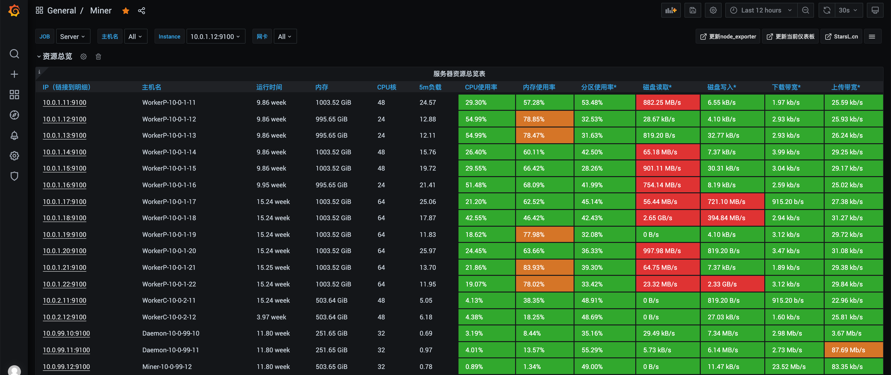
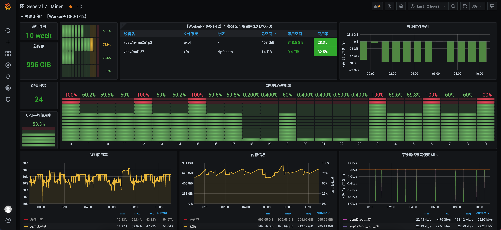

## Lotus-ops 
Lotus-ops is a set of Ansible Playbook scripts and Shell scripts that we organize and open source for the deployment and maintenance of Lotus mining software based on our own Lotus operation and maintenance practices. In addition, a complete Filecoin operation and maintenance operation manual is provided for the reference of Filecoin operation and maintenance personnel.

## Features
Seamlessly support the Lotus optimization software of the FilGuard team;
Ansible Playbook one-click deployment script is provided to deploy Daemon, Miner and Worker in batches with one click;
Provide common shell scripts for initializing the basic operating environment of Lotus, such as installing basic dependencies, SSD group Raid0, installing network card drivers, Worker checks, etc.;
Provide Prometheus + Grafana + Node-exporter monitoring tool deployment script, which can quickly build a Filecoin cluster monitoring platform;
Provides quick operations for frequently used Lotus commands to improve O&M efficiency.

## How to use
Please refer to [Lotus-ops Deployment Operation and Maintenance Tool Instructions](https://github.com/minerdao/posts/blob/master/posts/filecoin/ansible-deploy-tool-usage.md)。

## Filecoin operation and maintenance operation manual
We have compiled Filecoin-related operation and maintenance and operation manuals, including:
- [Detailed Explanation of Filecoin Packaging Process](https://github.com/minerdao/posts/blob/master/posts/filecoin/lotus-mining-process.md)
- [Filecoin latest mining hardware recommended configuration](https://github.com/minerdao/posts/blob/master/posts/filecoin/hardware-configuration.md)
- [Detailed Sector Life Cycle, Sector Status Management](https://github.com/minerdao/posts/blob/master/posts/filecoin/sector-life-cycle.md)
- [Filecoin node construction and startup](https://github.com/minerdao/posts/blob/master/posts/filecoin/daemon-deployment.md)
- [Node Management, Node Common Operations, Node Synchronization FAQ](https://github.com/minerdao/posts/blob/master/posts/filecoin/daemon-operation.md)
- [Wallet management and usage scenarios](https://github.com/minerdao/posts/blob/master/posts/filecoin/wallet-management.md)
- [Instructions for using Lotus-ops deployment operation and maintenance tool](https://github.com/minerdao/posts/blob/master/posts/filecoin/ansible-deploy-tool-usage.md)
- [Filecoin Homogeneous Cluster Construction Process](https://github.com/minerdao/posts/blob/master/posts/filecoin/mining-cluster-deployment.md)
- [Filecoin storage management, storage i/o performance analysis, network analysis](https://github.com/minerdao/posts/blob/master/posts/filecoin/storage-manage.md)
- [New miner node online CheckList](https://github.com/minerdao/posts/blob/master/posts/filecoin/new-miner-checklist.md)
- [Building of Filecoin monitoring and alarm system](https://github.com/minerdao/posts/blob/master/posts/filecoin/monitoring-deployment.md)
- [Filecoin Order Configuration](https://github.com/minerdao/posts/blob/master/posts/filecoin/deals-configuration.md)
- [Distributed Miner module configuration and usage](https://github.com/minerdao/posts/blob/master/posts/filecoin/distributed-miner-configuration.md)
- [How to avoid losing computing power](https://github.com/minerdao/posts/blob/master/posts/filecoin/miner-keep.md)
- [Lotus daily operation and maintenance CheckList](https://github.com/minerdao/posts/blob/master/posts/filecoin/lotus-ops-checklist.md)
- [Description of common environment variables](https://github.com/minerdao/posts/blob/master/posts/filecoin/environment-usage.md)
- [Automatic Pledge Script Instructions](https://github.com/minerdao/posts/blob/master/posts/filecoin/auto-pledge.md)
- Locating and solving common operation and maintenance problems
- [How to delete the stubborn sectors? ](https://github.com/minerdao/posts/blob/master/posts/questions.md#1-How to delete stubborn sectors)

